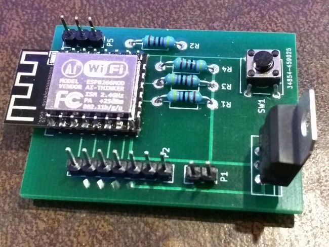

BasicESP Hardware Revision 1.0
==============================

Introduction
------------

This PCB design was the first manufactured in the basicesp line.  The basicesp
is designed to use the ESP-12 module and has:

   * 2mm pads for the ESP wifi module (the board has overhang/clearance space
     for the module so that the antenna gets no interference from the board)
   * Built-in 5V->3.3V regulator
   * A programming switch
   * A serial header
   * All the various resistors needed for mode setting

A GPIO header on the left side has the following pinout (from the top):

   1. GPIO16 (NodeMCU IO Index 0)
   2. GPIO14 (Index 5)
   3. GPIO12 (Index 6)
   4. GPIO13 (Index 7)
   5. +5V
   6. GND
   7. +3.3V

Notably an I2C display (like the Sainsmart LCD2004 controller) can be wired
straight to pins 3-6 without any gymnastics.  A typical PIR motion sensor
module can be wired to pins 4-6 with minimal gymnastics (swapping the OUT and
either VCC or GND connection to match ends).

Production and Files
--------------------

This board was produced in a 10-unit proto batch at pcbway in Jan, 2017.  The
file bundle I sent to them is in basicesp.wjblack.com.rev.1.0b.zip.

The design was done using kicad for both schematic, netlist, and PCB layout.
The kicad source files are all in [kicad/](kicad/).

When assembled, the board looks like this:

And here is a [PDF of the schematic](schematic.pdf).

Ease of Use
-----------

Developing with this board isn't too bad (indeed, it's much easier to solder up than the 16 individual wires I had to wire for other projects involving the
PIA 2mm pitch).

The parts are surprisingly not too heat-sensitive--I was able to get away with
a fine tip soldering iron and light solder direct on all joints (there are a
lot of plain header connects, which are just straightforward through-hole
soldering).

Shortcomings
------------

The biggest problem with this design is that it does not include the
manufacturer-recommended capacitors for the 3.3V regulator.  The ESP module
doesn't seem to care too much, but variations in power wreak havoc with the PIR
module I tried (soldering the caps directly to the regulator pins afterward
worked well to mitigate those problems).  This will be fixed in Rev 2.

Mounting holes will be added in Rev 2.

It would have been nice to put a +5V rail by the serial so it could be powered
(albeit temporarily) by a FTDI cable all on one side (the evils of attempting
this are debatable--you can *kinda* get away with it if the ESP isn't drawing
too much current.  Real EEs' heads will be exploding right about now, though).
A power and/or reset switch would be a nice-to-have, as would breaking out the
two GPIO pins I left NC.
