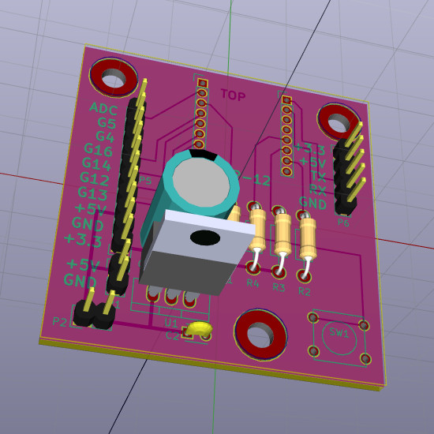

BasicESP Hardware Revision 2.0
==============================

Introduction
------------

This PCB design is the second in the basicesp line.  The basicesp is designed
to use the ESP-12 module and has:

   * 2mm pads for the ESP wifi module (the board has overhang/clearance space
     for the module so that the antenna gets no interference from the board)
   * Built-in 5V->3.3V regulator
   * A programming switch
   * A serial header
   * All the various resistors needed for mode setting

A GPIO header on the left side has the following pinout (from the top):

   1. ADC
   2. GPIO5 (NodeMCU IO Index 1)
   3. GPIO4 (Index 2)
   4. GPIO16 (Index 0)
   5. GPIO14 (Index 5)
   6. GPIO12 (Index 6)
   7. GPIO13 (Index 7)
   8. +5V
   9. GND
   10. +3.3V

Notably an I2C display (like the Sainsmart LCD2004 controller) can be wired
straight to pins 3-6 without any gymnastics.  A typical PIR motion sensor
module can be wired to pins 4-6 with minimal gymnastics (swapping the OUT and
either VCC or GND connection to match ends).

Production and Files
--------------------

This board is still under development and hasn't been sent to manufacture yet.

The design was done using kicad for both schematic, netlist, and PCB layout.
The kicad source files are all in [kicad/](kicad/).

When assembled, the board should look like this:

And here is a [PDF of the schematic](schematic.pdf).

Shortcomings
------------

It hasn't been built yet ;-)
